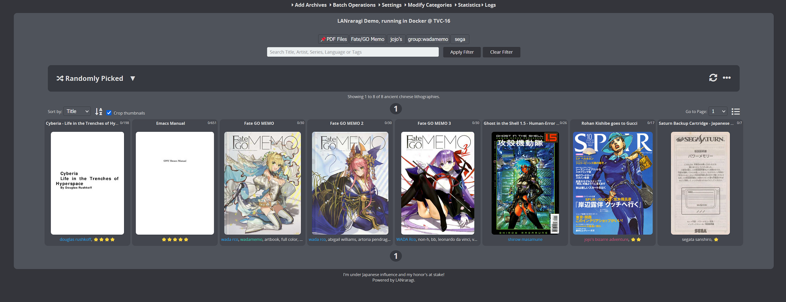
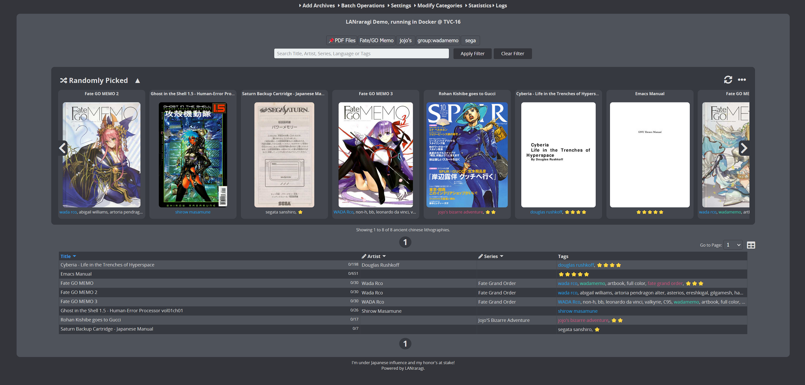

LANraragi_CN
============

用于漫画存档的开源服务器，使用 Mojolicious + Redis 运行，这是LANraragi的汉化版本，相较与原版汉化了界面，修复了chrome的js报错，并且使用root账户代替koyomi解决群晖nas上面的无法访问挂载文件夹/home/koyomi/lanraragi/content目录的问题,我构建了一个docker镜像，如果你是docker用户，你需要将漫画文件夹挂载到/root/lanraragi/content，数据库挂载到/root/lanraragi/database。

#### docker用户使用指南

docker用户可以自行切换到 windycloud/lanraragi_cn:latest 镜像即可安装完成

#### 💬 在 [Discord](https://discord.gg/aRQxtbg) 或 [GitHub Discussions](https://github.com/Difegue/LANraragi/discussions) 与其他 LANraragi 用户交流

#### [📄 文档[英文]](https://sugoi.gitbook.io/lanraragi/v/dev) | [⏬ 下载](https://github.com/Difegue/LANraragi/releases/latest) | [🎞 演示](https://lrr.tvc-16.science) | [🪟🌃 Windows 版本](https://nightly.link/Difegue/LANraragi/workflows/push-continous-delivery/dev) | [💵 赞助以支持项目发展](https://ko-fi.com/T6T2UP5N)

## 截图

| 主页, 缩略视图                                                                                                                                      | 主页, 列表视图                                                                                                                                   |
| --------------------------------------------------------------------------------------------------------------------------------------------------- | ------------------------------------------------------------------------------------------------------------------------------------------------ |
|  |  |

| 档案阅读器                                                                                                                     | 档案预览阅读器                                                                                                                                         |
| ------------------------------------------------------------------------------------------------------------------------------ | ------------------------------------------------------------------------------------------------------------------------------------------------------ |
|  |  |

| 配置页面                                                                                                              | 插件配置页面                                                                                                                               |
| --------------------------------------------------------------------------------------------------------------------- | ------------------------------------------------------------------------------------------------------------------------------------------ |
|  |  |

## 特点

* 以压缩或存档的形式预览你的漫画. 目前支持(zip/rar/targz/lzma/7z/xz/cbz/cbr/pdf supported, barebones support for epub)等格式。
* 直接从浏览器或专用客户端阅读漫画: 服务器内使用临时文件夹临时存放从压缩或存档里读取的数据
* 使用内置 OPDS 目录（现在支持 PSE！）在专用阅读器软件中阅读您的漫画
* 使用客户端 API 从其他程序与 LANraragi 交互 (适用于[许多平台!](https://sugoi.gitbook.io/lanraragi/v/dev/advanced-usage/external-readers))
* 1. 安卓客户端（已提交中文支持）：https://f-droid.org/packages/com.utazukin.ichaival/
  2. IOS客户端(用AltStore安装)： https://github.com/Doraemoe/DuReader/releases
     AltStore:https://altstore.io/
  3. Windows客户端（已提交中文支持）： https://www.microsoft.com/zh-cn/p/lrreader/9mz6bwwvswjh
* 两个不同的用户界面：紧凑型档案列表，带有缩略图或缩略图视图。
* 从5个内置的CSS主题中进行选择，或添加自己的CSS样式。
* 具有完整的命名空间Tags支持：使用插件添加或从其他的来源导入它们。
* 档案存储在手动选定或动态类别中，在将档案添加到lanraragi时，可以自动使用插件对库内部的文档进行排序。
* 将档案直接从互联网下载到服务器的同时自动导入元数据。

*将数据库备份为JSON，以将Tags传递到另一个LANraragi实例。

## 扫码直接查看教程

## Make a PR, get stickers™

Merged PRs to this repo(or $5+ donations) are eligible to get a dumb sticker pack [shipped on the house.](https://forms.office.com/Pages/ResponsePage.aspx?id=DQSIkWdsW0yxEjajBLZtrQAAAAAAAAAAAAN__osxt25URTdTUTVBVFRCTjlYWFJLMlEzRTJPUEhEVy4u)
